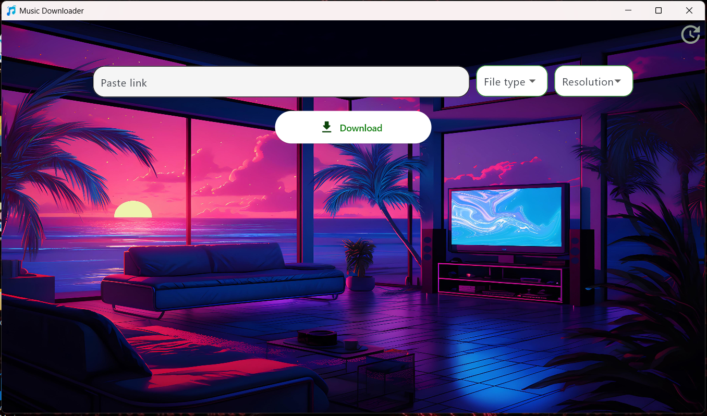
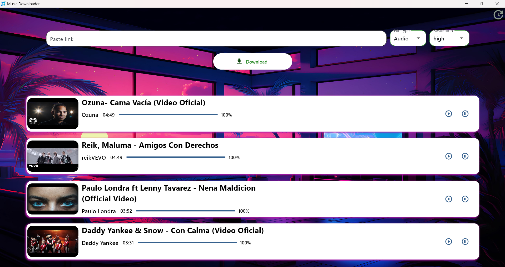

# MusicDownloader

¡Hola! En esta ocasión he creado una aplicación para descargar música y videos con audio desde YouTube. Este es un proyecto de práctica que he realizado para mejorar mis habilidades de programación y es una herramienta muy útil para quienes desean descargar contenido de YouTube rápidamente.

## Descripción

MusicDownloader es una aplicación desarrollada en Python, utilizando la librería **Flet** para la interfaz gráfica y **pytubefix** para la descarga de videos y audios desde YouTube. El funcionamiento es sencillo y directo:

1. Copia el enlace de YouTube del contenido que deseas descargar.
2. Pega el enlace en el campo de texto correspondiente en la aplicación.
3. Selecciona si deseas descargar solo el **audio** o el **video** con audio.
4. Elige la calidad de la descarga.
5. Haz clic en el botón **Download** y la descarga comenzará de inmediato.

## Características

- Descarga música o videos con audio desde YouTube.
- Permite elegir la calidad del contenido a descargar.
- Interfaz gráfica simple y fácil de usar.
- Hecho en Python con Flet y pytubefix.

## Requisitos

- Python 3.x
- Librerías necesarias:
  - Flet
  - pytubefix

